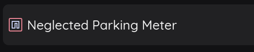
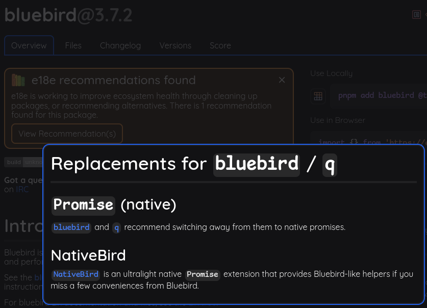
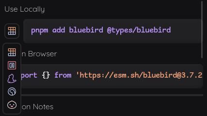
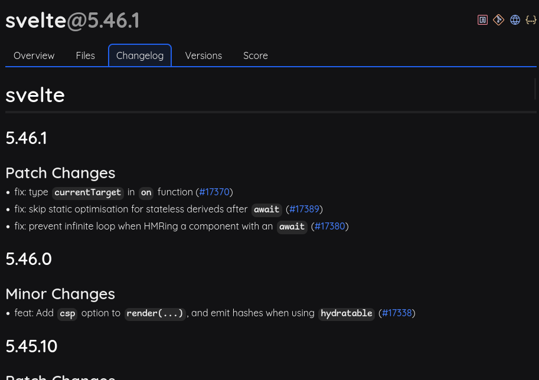
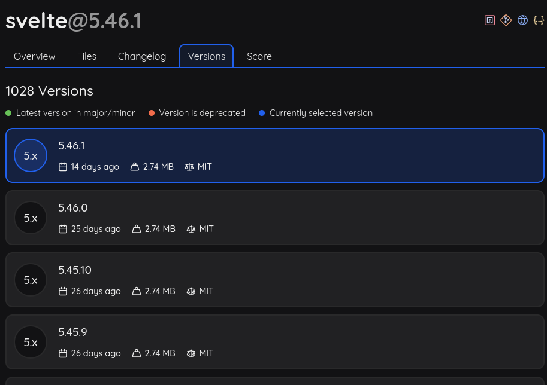
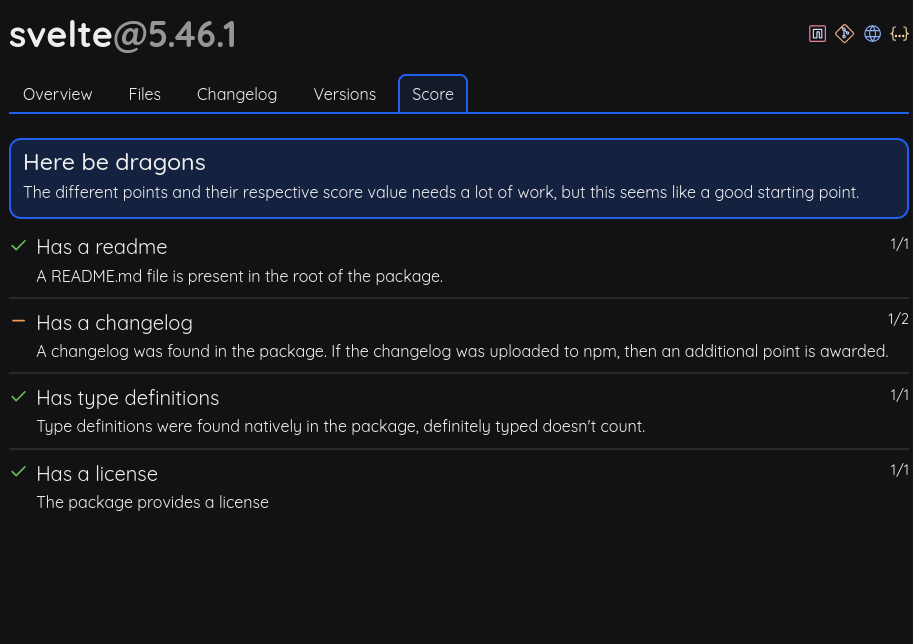
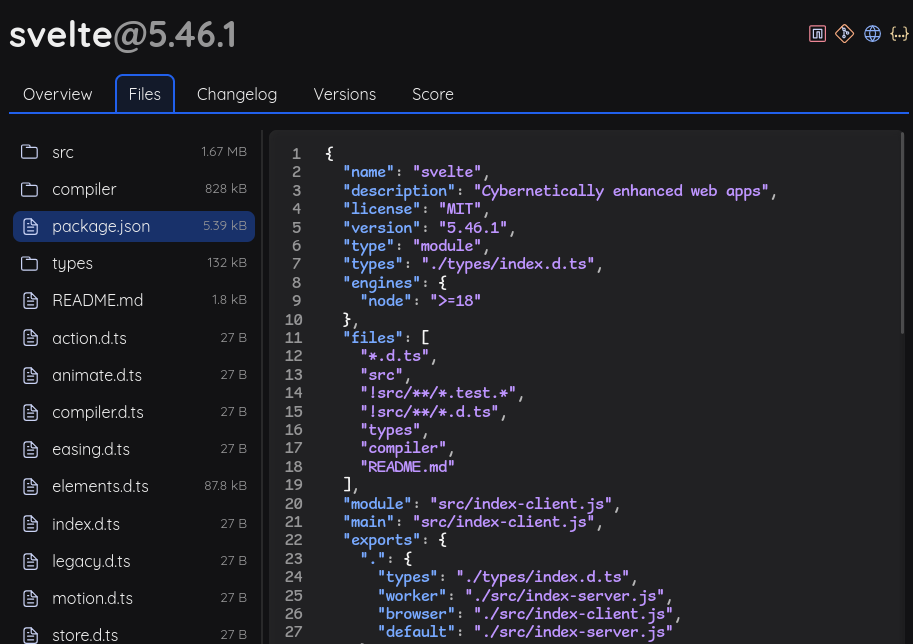

# npm-alt (name tbd)

An alternative frontend for npm that aims to provide a better experience, with more useful supplemental information.

> [!NOTE]
> There is an instance up at https://npm.willow.sh until I find it a permenant home.
> Mobile users beware...

## Extra Features

### npm acronyms

The most important feature, the old npm acronyms.

### e18e suggestions

Shows e18e suggestions on packages.

### install options

- Selectable package manager install options
- Adds the @types package if required
- Shows browser import for script[type=module]

### changelog viewer

Tries to fetch the changelog from the npm package files, the repo, or GitHub releases.

### better version viewer

Inspired by jsr/crates.io

### package score

Inspired by jsr, very much a work in progress

### non-beta file viewer

:p

